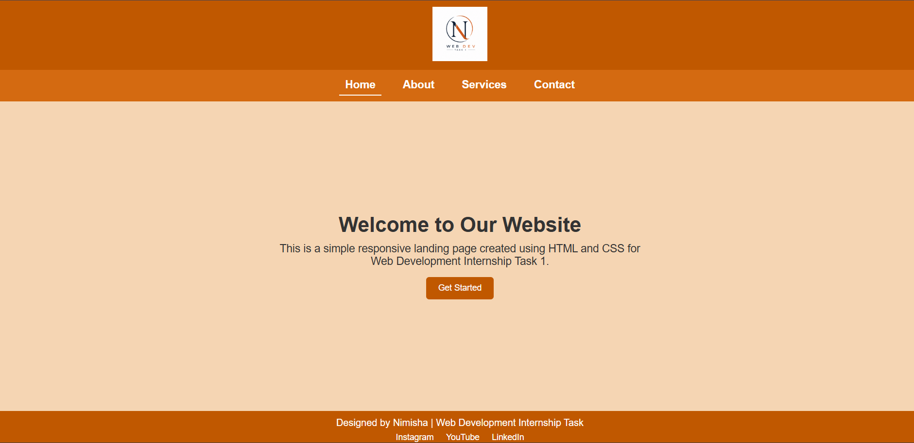
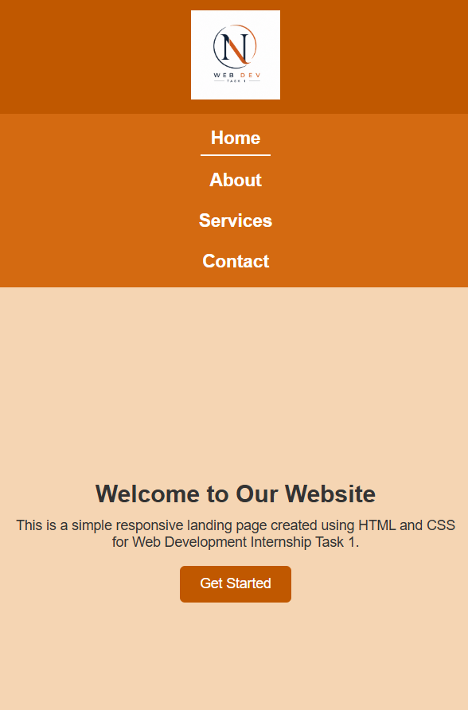

# 🌐 Web Development Internship - Task 1

## 📌 Project Title

Simple Responsive Landing Page Using HTML & CSS

---

## 🎯 Objective

Build a clean and responsive landing page using HTML5 and CSS3 that includes a header, navigation bar, hero section, call-to-action button, and footer.

---

## 🛠️ Technologies Used

* HTML5
* CSS3
* Flexbox
* Media Queries

---

## ✨ Features

* Responsive navigation bar
* Hero section with heading, description, and button
* Footer with social media links
* Mobile-friendly responsive design
* Flexbox-based layout
* Simple and clean user interface
* Multi-page navigation structure

---

## 📁 Project Structure

```text
ELEVATE_LABS_INTERNSHIP/
└── Task1
    ├── index.html
    ├── about.html
    ├── services.html
    ├── contact.html
    ├── style.css
    ├── logo.png
    ├── homepage_desktop.png
    ├── homepage_mobile_0.png
    ├── homepage_mobile_1.png
    ├── aboutpage_desktop.png
    ├── aboutpage_mobile.png
    ├── servicespage_desktop.png
    ├── servicespage_mobile.png
    ├── contactpage_desktop.png
    ├── contactpage_mobile.png
    └── README.md
```

---

## 🔗 Navigation Pages

The **About**, **Services**, and **Contact** pages were created to demonstrate the functionality of the navigation links. The primary focus of this task is the responsive landing page available on the Home page.

---

## 📱 Responsive Design

This project is fully responsive and adapts to different screen sizes using CSS Media Queries.

### Desktop View

* Horizontal navigation bar
* Full-width layout
* Larger text and spacing

### Mobile View

* Navigation links stack vertically
* Adjusted font sizes
* Optimized spacing for smaller screens

Media Query Used:

```css
@media (max-width: 768px)
```

---

## 📸 Screenshots

### Home Page - Desktop



### Home Page - Mobile



---

## 🚀 How to Run the Project

1. Download or clone the repository.
2. Open the project folder in VS Code.
3. Open `index.html`.
4. Run using the Live Server extension.

OR

Open `index.html` directly in any web browser.

---

## 👩‍💻 Author

**Budati Nimisha Sri Sai**

Web Development Internship - Task 1

---

## 📌 Note

This project was created for learning purposes as part of a Web Development Internship assignment. It demonstrates the implementation of HTML5 structure, CSS styling, Flexbox layouts, and responsive web design using Media Queries.
